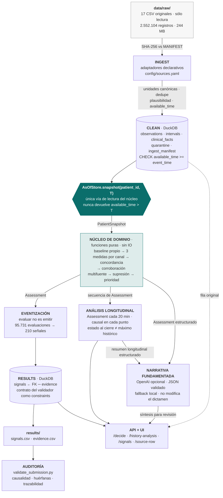
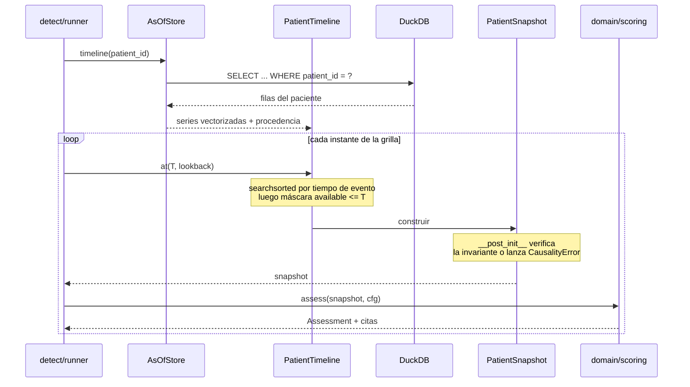
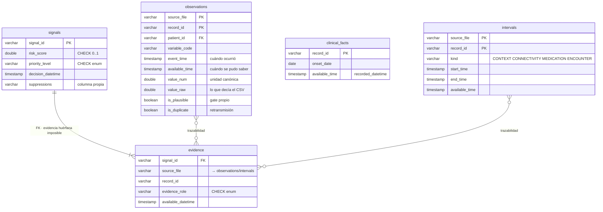
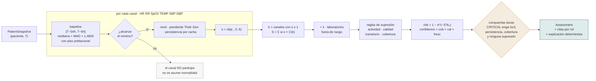

# Arquitectura — HealthSignal LATAM

| | |
|---|---|
| **Versión** | 0.2 · 2026-08-27 |
| **Corresponde a** | El prototipo efectivamente implementado, no a una arquitectura futura |
| **Verificación** | La tabla de la §6 mapea cada componente del diagrama a su archivo y sus pruebas |

---

## 1. Vista general

**Vectorizado abajo, dominio arriba.** Las capas de volumen se resuelven en SQL sobre DuckDB;
el núcleo que decide es Python puro sin IO. La frontera se cruza por paciente y por instante de
decisión; el análisis longitudinal repite ese mismo corte causal y resume el período sin cambiar
la semántica de cada decisión puntual.

---

## 2. Por qué ese corte

Modelar cada una de las 1.622.969 observaciones como objeto de dominio para cruzar fronteras
destruiría el rendimiento sin aportar nada. Y en un pipeline puro, la regla `available_time ≤ T`
se cumple por disciplina: un `join` mal escrito la viola en silencio.

La línea cae donde cambia la naturaleza del trabajo:

| | Cómputo sobre lotes | Decisión sobre un paciente en un instante |
|---|---|---|
| Dónde vive | `ingest.py`, SQL, DuckDB | `domain/scoring.py` |
| Qué maneja | 2,5 M filas | ~900 muestras de un paciente |
| Cómo se prueba | Consultas sobre el almacén | Trayectorias sintéticas, sin CSV |

---

## 3. El puerto as-of

El corte temporal se aplica **tres veces a propósito**: en la cláusula SQL para no traer de más,
en `PatientTimeline.at()` que es la garantía, y en el constructor de `PatientSnapshot` que lo
verifica. Mientras el motor no tenga otra forma de leer, el temporal leakage no es un error que
haya que buscar: es inexpresable.

Un detalle que ninguna cláusula `WHERE` detecta: un intervalo en curso revela su final.
`Interval.end_as_of(T)` lo recorta — saber que el sueño de un paciente termina a las 06:00
cuando son las 01:00 es información futura.

---

## 4. Modelo de datos

Tres formas, todas con doble timeline. Las 17 fuentes se normalizan hacia ellas.

**El contrato del validador oficial vive como restricciones de base.** `risk_score` fuera de
[0,1], una prioridad inventada, una ventana posterior a la decisión o una fila de evidencia sin
señal **fallan al insertar**. Exportar es después un `COPY`, y pasar `validate_submission.py`
deja de ser una tarea para ser una consecuencia.

---

## 5. El analizador

Tres decisiones que definen el comportamiento:

- **El recorte por canal antes de agregar** hace que la concordancia pese más que la magnitud
  por construcción, no por ajuste de umbrales.
- **La persistencia se mide como racha consecutiva**, no como fracción de la ventana. La
  fracción castiga a la señal temprana justo cuando más vale detectarla.
- **La cobertura no multiplica el riesgo.** Un paciente desconectado no está menos grave por
  estar desconectado: está peor observado. La cobertura decide si un canal participa y alimenta
  `confidence_score`, que es un eje independiente.

Cada regla de supresión que se activa **emite su propia fila de evidencia** con el `record_id`
que la justifica. Y cuando el contexto está presente pero **no** explica el patrón, se registra
igual con fuerza cero: haber evaluado una hipótesis alternativa y haberla descartado es una
decisión, y las decisiones no se toman en silencio.

---

## 6. Correspondencia entre diagrama y código

| Componente del diagrama | Archivo | Pruebas que lo cubren |
|---|---|---|
| INGEST · adaptadores | `config/sources.yaml` + `src/hs/ingest.py` | `test_ingest.py` |
| Verificación SHA-256 | `src/hs/manifest.py` | `test_ingest.py` |
| CLEAN · esquema y restricciones | `src/hs/schema.sql` | `test_ingest.py`, `test_no_leakage.py` |
| **AsOfStore** · el puerto | `src/hs/timeline/store.py` | `test_no_leakage.py` |
| Objetos de dominio | `src/hs/domain/models.py` | `test_no_leakage.py` |
| **Analizador puntual** | `src/hs/domain/scoring.py` | `test_trajectories.py` |
| **Análisis longitudinal** | `src/hs/detect/history.py` | `test_api.py`, `test_narrative.py` |
| Narrativa fundamentada | `src/hs/narrative/service.py` | `test_narrative.py` |
| Eventización | `src/hs/detect/runner.py` | `test_contract.py` |
| Exportación y auditoría | `src/hs/export/writer.py` | `test_contract.py` |
| API y trazabilidad | `src/hs/api/app.py` | `test_api.py` |
| Interfaz | `ui/index.html` | verificación local de los dos modos temporales |

Cada caja del diagrama existe como código ejecutable; ninguna representa trabajo futuro.

---

## 7. Seguridad y operación

| Aspecto | Cómo se resuelve |
|---|---|
| Datos originales | Sólo lectura. Hash verificado en cada corrida; una discrepancia detiene el proceso |
| Acceso a la base | La API abre DuckDB en modo `read_only`; no expone SQL arbitrario |
| Trazabilidad de rutas | `source_file` se valida contra la lista de fuentes cargadas: la ruta nunca se construye con texto libre del pedido. Probado con travesía de directorios |
| Credenciales | `OPENAI_API_KEY` en `.env`, sólo en el backend y sólo para narrativa; nunca llega a la UI ni altera el dictamen |
| Separación de componentes | Ingesta, decisión y consulta son procesos distintos sobre el mismo almacén |
| Minimización | La API expone resultados y procedencia, no volcados de la cohorte |

**Conectividad intermitente por diseño.** El sistema no asume disponibilidad uniforme: la
cobertura de cada ventana es un conteo exacto contra la grilla nominal, y su degradación baja la
confianza en vez de fabricar riesgo. Incorporar una fuente nueva es agregar una declaración a
`config/sources.yaml`, no modificar el pipeline.

---

## 8. Lo que no está implementado

Para que el diagrama corresponda al prototipo, conviene decir también qué no hay:

- **No hay modelo entrenado.** No existen etiquetas públicas; el Gold Standard es privado.
- **No hay componente generativo en la ruta de decisión.** OpenAI actúa después del `Assessment`
  para redactar una síntesis opcional. Ningún modelo interviene en el cálculo de puntaje, la
  asignación de prioridad ni la selección de evidencia; cualquier falla usa un fallback local.
- **No hay streaming ni procesamiento distribuido.** El dataset es estático y congelado.
- **No hay autenticación de usuarios.** La API es local y de sólo lectura; en un despliegue real
  haría falta control de acceso por rol.
- **La calibración es de una sola cohorte.** Las constantes viven en `config/scoring.yaml` y el
  dataset se declara `Candidate 1 — not yet frozen`: recalibrar es correr un script.
